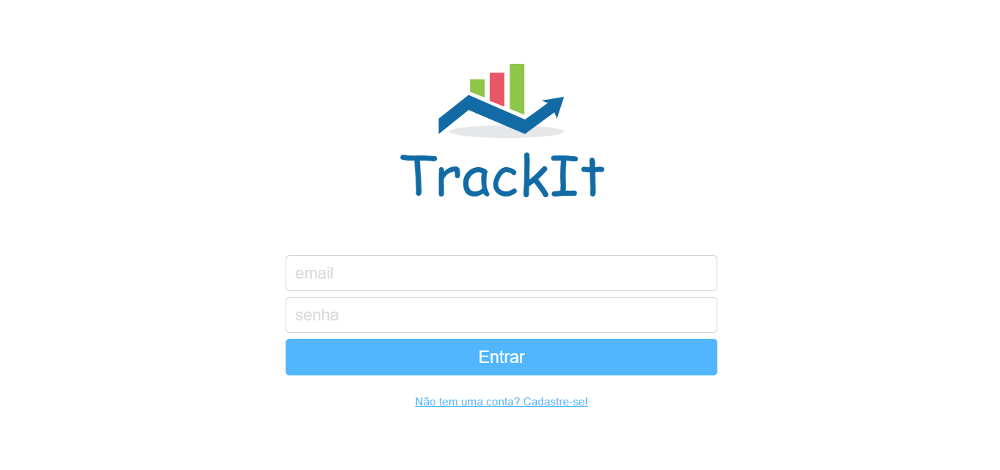

# 
TrackIt

### 
Tecnologias Utilizadas:

   
   
   
  

## 📖 Descrição
Nesse projeto fizemos um aplicativo gerenciador de tarefas! Com ele o usuário poderá organizar atividades, permitindo que ele: 

#Liste tarefas de forma organizada;
#Defina prioridades;
#Acompanhe o status de cada tarefa;
#Planeje projetos;
#Programe atividades; e
#Gerencie o tempo.

## 🚀 Instalação
Baixe o repositório do projeto no github e execute em sua máquina. Ou se preferir, acesse o aplicativo online no link abaixo:

💬 [**Acesse aqui**](https://trackit-steel.vercel.app/)
## 💻 Preview

$~$

[🔝 De volta ao topo](#TrackIt)

